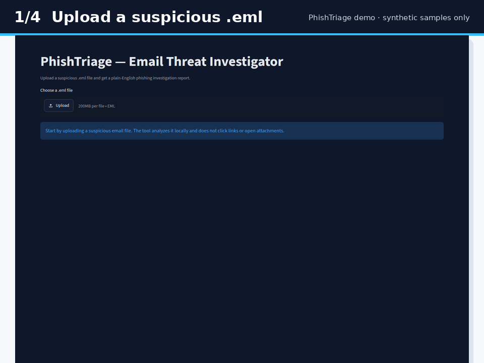
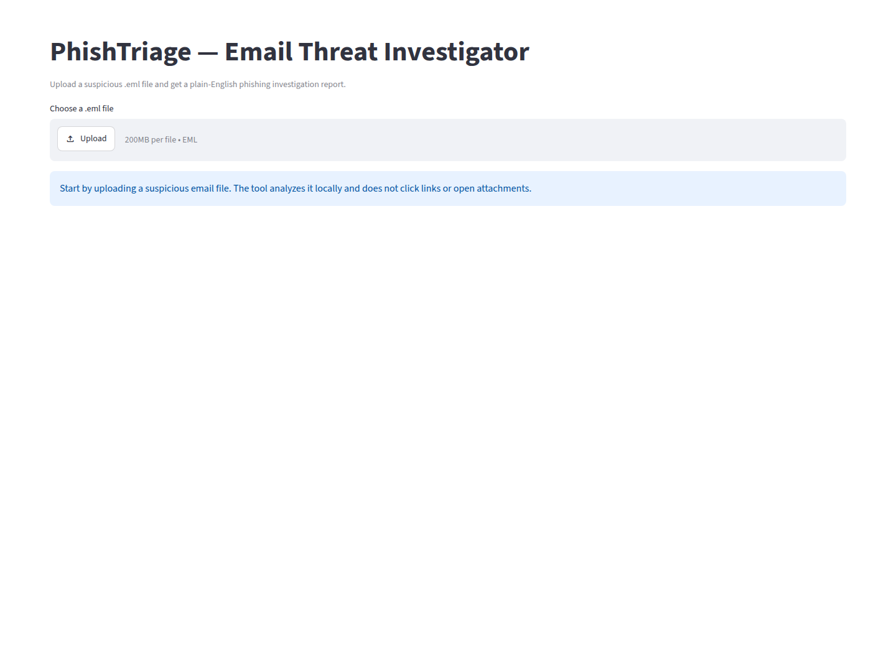
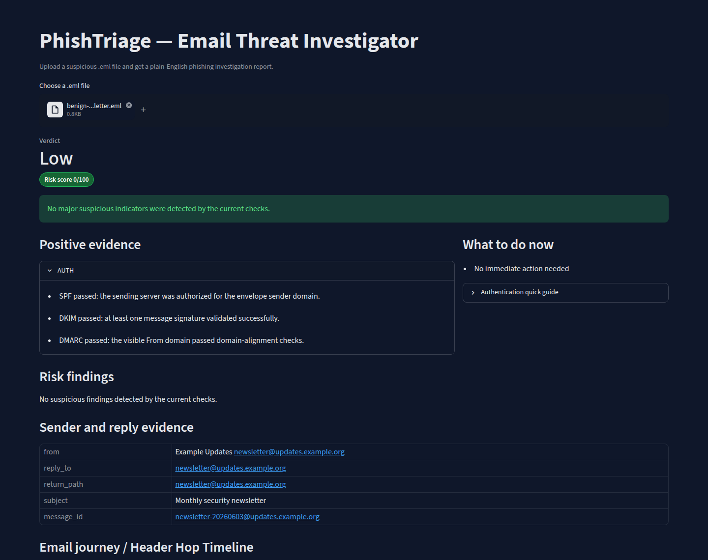
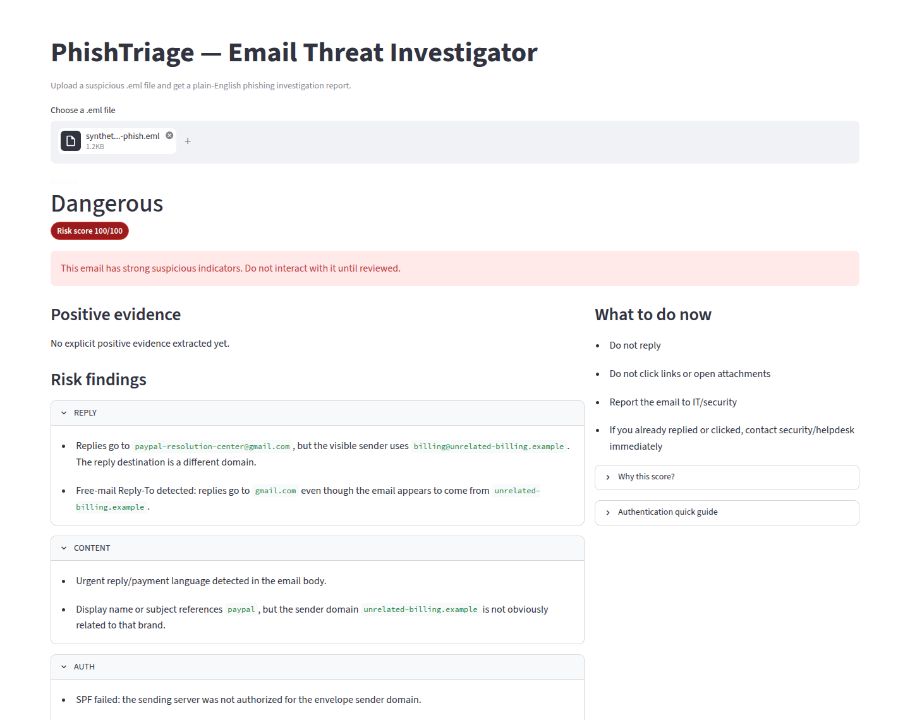
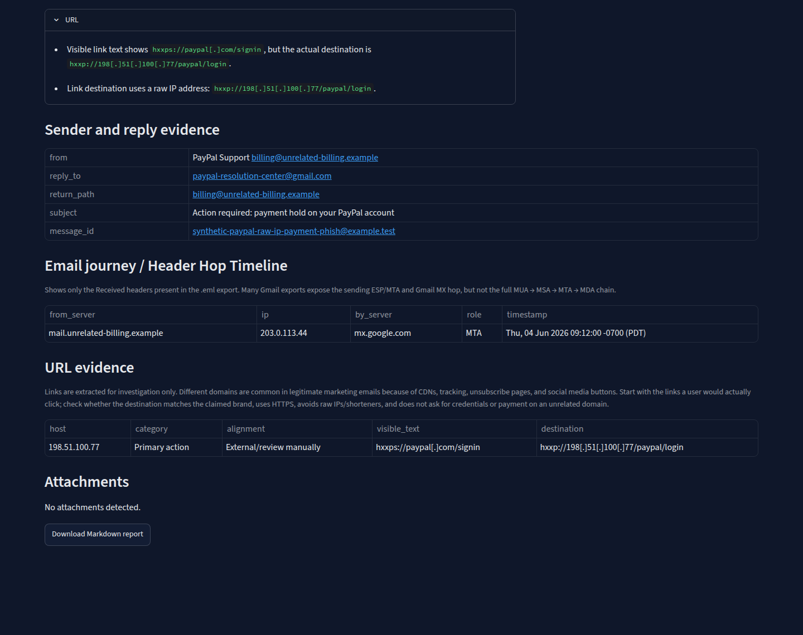

# Email Threat Investigator / PhishTriage

Email Threat Investigator, also called PhishTriage in the app and CLI, is a local Python toolkit for analyzing suspicious `.eml` files. It parses email headers and body content, separates positive evidence from risk findings, reconstructs the visible header route, extracts URLs and attachments, and produces plain-English reports for non-technical users and SOC-style review.

The project is designed as a cybersecurity portfolio showcase: explainable, evidence-grounded, safe to demo, and useful for real phishing/BEC triage workflows without clicking links or opening attachments.

## What it answers

1. Is this email suspicious?
2. Why is it suspicious?
3. What should I do next?
4. What technical evidence supports that answer?

## Current capabilities

- Parses `.eml` files locally with Python's standard email parser.
- Scores risk from `0` to `100` with transparent findings.
- Produces verdicts: `Low`, `Suspicious`, `High Risk`, `Dangerous`.
- Separates zero-point positive/context evidence from scored risk findings.
- Shows SPF, DKIM, and DMARC results with plain-English caveats.
- Warns when input quality is limited, such as body-only files renamed to `.eml`.
- Detects forwarding and ARC context where headers preserve upstream authentication.
- Recognizes common ESP/marketing infrastructure patterns, including Salesforce Marketing Cloud, SendGrid, Mailchimp, Amazon SES, Mailgun, Postmark, Brevo/Sendinblue, and Omnisend/Soundest indicators.
- Reduces false positives for authenticated marketing/transactional mail when infrastructure differences are explainable.
- Detects sender and reply-path risks:
  - suspicious Reply-To mismatch;
  - free-mail reply destination for corporate-looking senders;
  - generated/random-looking From addresses;
  - unusually long or generated Return-Path domains;
  - suspicious From/Return-Path mismatch when not explained by authentication, ESP context, or forwarding.
- Detects authentication risks:
  - SPF fail/softfail;
  - DKIM fail/permerror/temperror;
  - missing or non-passing DMARC when Authentication-Results evidence exists.
- Reconstructs an Email Journey / Header Hop Timeline from actual `Received` headers only.
- Extracts URL evidence without visiting destinations.
- Defangs URLs in UI/report-facing output.
- Categorizes URL evidence for manual review, such as primary action, account/security/payment, unsubscribe/preferences, social/footer, CDN/static asset, ESP tracking/redirect, cloud-hosted landing page, and external/review manually.
- Flags strong URL risks such as raw IP destinations, visible-text/destination deception, unrelated cloud-hosted HTML landing pages, suspicious List-Unsubscribe mismatch, and giant clickable body wrappers.
- Extracts attachment metadata: filename, content type, size, and SHA256.
- Flags suspicious attachment extensions and double extensions.
- Generates Markdown investigation reports.
- Provides both CLI and Streamlit web UI.
- Includes safe synthetic sample emails for demos and regression tests.

## Screenshots and demo

The demo GIF and screenshots below use committed synthetic sample emails only. They do not show private inbox data or real user emails.

### Demo GIF



### Upload screen



### Low-risk result with positive authentication evidence



### Dangerous result with plain-English risk findings



### URL evidence and defanged destination review



## Safety model

PhishTriage is intentionally static and local.

It does not:

- click links;
- fetch URLs;
- open attachments;
- detonate malware;
- connect to Gmail, Outlook, or a live mailbox;
- quarantine, delete, or forward messages;
- send email contents to external APIs;
- use hidden AI/black-box verdicts.

Every finding is rule-based and should map to visible evidence in the message.

## Install and run

This project uses `uv`.

```bash
uv sync
uv run pytest -q
```

Analyze a sample email:

```bash
uv run phishtriage analyze samples/synthetic-paypal-raw-ip-payment-phish.eml
```

Write a Markdown report:

```bash
uv run phishtriage analyze samples/synthetic-paypal-raw-ip-payment-phish.eml --out reports/paypal-raw-ip-report.md
```

Run the web UI:

```bash
uv run streamlit run src/phishtriage/app.py
```

Then open the local Streamlit URL and upload a `.eml` file.

## 5-minute reviewer path

For recruiters, instructors, or teammates who want to evaluate the project quickly:

1. Run `uv sync && uv run pytest -q` to confirm the test suite is green.
2. Run the CLI example against `samples/synthetic-paypal-raw-ip-payment-phish.eml` and confirm it explains the risky reply path, failed authentication, and raw-IP URL.
3. Run the Streamlit UI and upload one benign sample plus one dangerous sample:
   - benign: `samples/legitimate-company-email.eml`
   - dangerous: `samples/synthetic-paypal-raw-ip-payment-phish.eml`
4. Review the generated Markdown report to see how technical evidence is translated into user-facing guidance.

The whole demo uses committed synthetic samples only; no real inbox data is needed.

## Example CLI output

```text
Verdict: Dangerous
Score: 100/100

Email server path:
- mail.unrelated-billing.example [203.0.113.44] -> mx.google.com
- Note: Route is based only on visible Received headers; some hops may be missing.

Positive evidence:
- No explicit positive evidence extracted yet.

Why this is suspicious:
- [reply] Replies go to `paypal-resolution-center@gmail.com`, but the visible sender uses `billing@unrelated-billing.example`. The reply destination is a different domain.
- [reply] Free-mail Reply-To detected: replies go to `gmail.com` even though the email appears to come from `unrelated-billing.example`.
- [content] Urgent reply/payment language detected in the email body.
- [content] Display name or subject references `paypal`, but the sender domain `unrelated-billing.example` is not obviously related to that brand.
- [auth] SPF failed: the sending server was not authorized for the envelope sender domain.
- [auth] DKIM failed: the message signature could not be validated.
- [auth] DMARC failed: the visible From domain did not pass domain-alignment checks.
- [url] Visible link text shows `https://paypal.com/signin`, but the actual destination is `http://198.51.100.77/paypal/login`.
- [url] Link destination uses a raw IP address: `http://198.51.100.77/paypal/login`.

Recommended action:
- Do not reply
- Do not click links or open attachments
- Report the email to IT/security
- If you already replied or clicked, contact security/helpdesk immediately
```

## Streamlit UI

The web UI is aimed at non-technical users and reviewers:

- prominent verdict and neutral `Risk score N/100` badge;
- positive evidence section;
- risk findings section;
- collapsed `Why this score?` category breakdown;
- collapsed `Authentication quick guide` explaining SPF, DKIM, and DMARC;
- sender/reply evidence table;
- visible header-hop timeline with limitation note;
- URL evidence table with defanged destinations;
- attachment evidence table;
- Markdown report download.

## Markdown reports

Reports mirror the UI evidence model:

- Executive Summary
- Positive Evidence
- Authentication quick guide
- Evidence Completeness
- Why this is suspicious
- What to do now
- Sender and Reply Evidence
- Email Journey / Header Hop Timeline
- URL Evidence
- Attachment Evidence
- Technical Notes

Generated reports are ignored by default under `reports/*.md`, except `reports/README.md`.

## Synthetic sample emails

All committed samples are synthetic and safe. They use documentation/test domains, reserved IP ranges, or fictional infrastructure.

Baseline samples:

- `samples/benign-newsletter.eml`
- `samples/legitimate-company-email.eml`
- `samples/suspicious-reply-to-bec.eml`
- `samples/bec-reply-only-scam.eml`
- `samples/fake-microsoft-login.eml`

Expanded scenario samples:

- `samples/synthetic-forwarded-arc-legitimate.eml`
- `samples/synthetic-salesforce-marketing-email.eml`
- `samples/synthetic-omnisend-splach-marketing.eml`
- `samples/synthetic-iptv-cloud-storage-spam.eml`
- `samples/synthetic-chronopost-cloud-storage-phish.eml`
- `samples/synthetic-paypal-raw-ip-payment-phish.eml`
- `samples/synthetic-invoice-attachment-phish.eml`
- `samples/synthetic-generated-sender-spam.eml`

Do not commit real personal emails, malware, downloaded corpora, or generated reports containing personal data.

## Project structure

```text
src/phishtriage/
  app.py                    Streamlit UI and display model
  cli.py                    CLI entrypoint
  parser.py                 .eml parsing
  models.py                 Data models
  reply_analyzer.py         Reply-To and BEC language analysis
  sender_analyzer.py        generated sender / Return-Path analysis
  auth_analyzer.py          SPF/DKIM/DMARC parsing
  infrastructure_analyzer.py ESP/marketing/forwarding context
  route_analyzer.py         Received-header timeline
  url_analyzer.py           static URL extraction and URL evidence
  attachment_analyzer.py    attachment metadata and extension checks
  content_analyzer.py       static content/HTML phishing indicators
  scoring.py                transparent score and verdict mapping
  report.py                 Markdown report renderer

tests/                      pytest suite
samples/                    safe synthetic .eml fixtures
reports/                    local generated reports, ignored except README
docs/plans/                 planning notes and product decisions
```

## Risk scoring

The risk score is intentionally explainable. Findings add points; positive/context evidence is zero-point and excluded from risk totals. The score is capped at 100.

Verdicts:

- `0-20`: Low
- `21-45`: Suspicious
- `46-70`: High Risk
- `71-100`: Dangerous

Examples of scored signals:

- free-mail Reply-To for a corporate-looking sender;
- suspicious Reply-To mismatch;
- generated/random-looking sender identity;
- DKIM failure or permanent error;
- non-passing DMARC;
- unexplained route anomaly;
- raw-IP URL;
- visible link text pointing somewhere else;
- unrelated cloud-hosted HTML landing page;
- suspicious unsubscribe mismatch;
- giant clickable HTML body wrapper;
- suspicious attachment extension or double extension;
- brand/content impersonation evidence.

## Portfolio positioning

This project demonstrates:

- Python automation and packaging;
- email header parsing;
- SPF/DKIM/DMARC interpretation;
- BEC and phishing investigation logic;
- static IOC extraction;
- safe handling of suspicious artifacts;
- explainable rule-based detection;
- test-driven development;
- CLI, Streamlit UI, and Markdown reporting;
- practical SOC-style evidence presentation.

## Roadmap

Completed showcase polish:

- Demo screenshots and animated GIF using only synthetic samples.
- Safe synthetic sample set covering benign, suspicious, marketing, forwarded, URL, attachment, and BEC-style scenarios.
- A 5-minute reviewer path for quickly testing the CLI, UI, and report output.

Near-term improvements:

1. Add JSON export for analyst workflows.
2. Add confidence/evidence-completeness score separate from risk.
3. Add batch analysis for folders of `.eml` files.
4. Add optional URL reputation enrichment behind user-provided API keys, disabled by default.
5. Add more benign/transactional synthetic samples to keep false positives honest.

## Privacy and public-repo checklist

Before publishing screenshots or pushing to GitHub:

- use synthetic `.eml` samples only;
- do not publish personal Gmail exports, real order emails, Message-IDs, names, addresses, tracking numbers, or reports containing personal data;
- keep downloaded corpora in ignored local folders such as `data/external/`;
- keep malware or suspicious attachments out of the repo;
- regenerate reports locally when needed instead of committing them.
